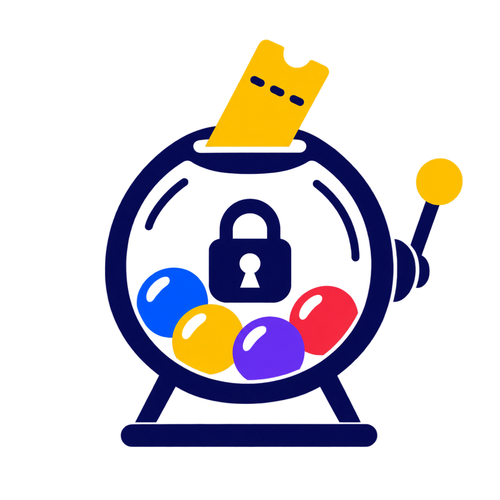
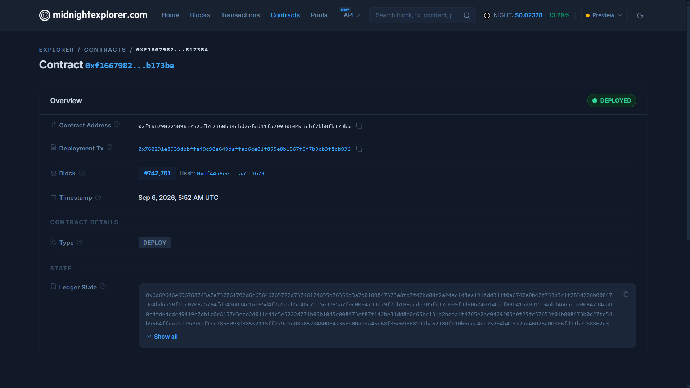
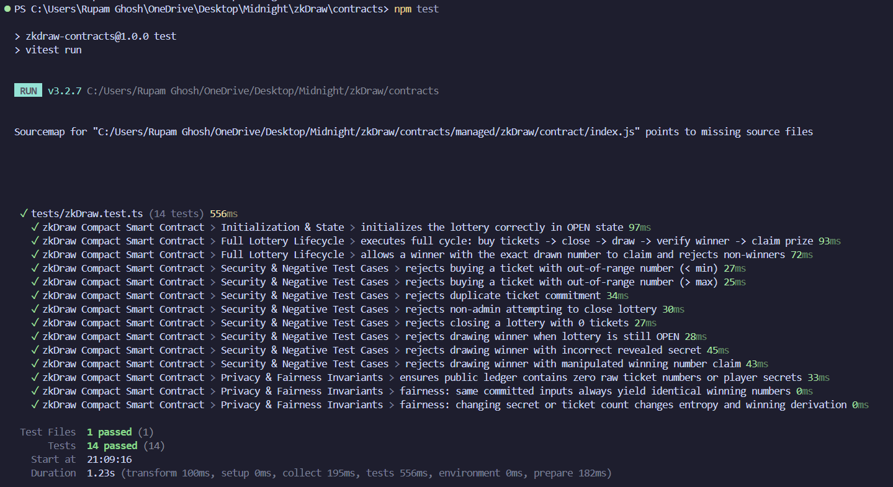
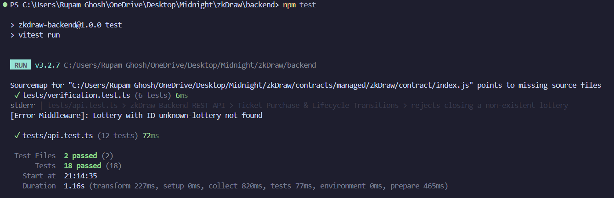
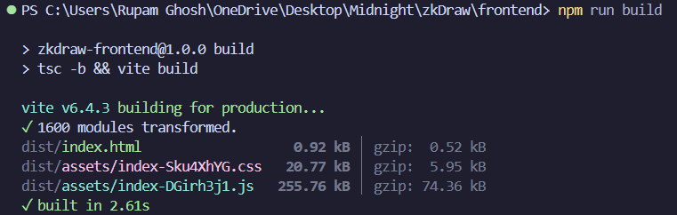
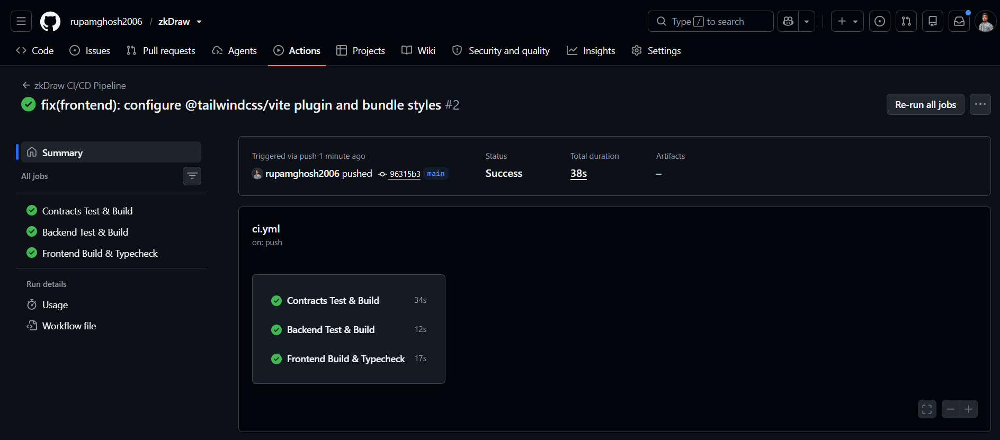

# zkDraw

<div align="center">
  

  [](https://github.com/rupamghosh2006/zkDraw/actions/workflows/ci.yml)
  
  
  
  
  [](https://x.com/zkdraw_midnight)

  <p align="center">
    <strong>Decentralized, privacy-preserving, and mathematically provably fair lottery built natively on the Midnight blockchain using Compact smart contracts and zero-knowledge proofs.</strong>
  </p>

  <p align="center">
    <a href="#live-demo"><strong>Live Demo</strong></a> •
    <a href="#demo-video"><strong>Demo Video</strong></a> •
    <a href="#contract-address"><strong>Contract Address</strong></a> •
    <a href="#what-this-product-does"><strong>Overview</strong></a> •
    <a href="#privacy-model"><strong>Privacy Model</strong></a> •
    <a href="#tech-stack"><strong>Tech Stack</strong></a> •
    <a href="#setup--run-locally"><strong>Local Setup</strong></a> •
    <a href="#run-tests"><strong>Testing</strong></a> •
    <a href="#cicd"><strong>CI/CD</strong></a> •
    <a href="#usage-guide"><strong>Usage Guide</strong></a> •
    <a href="#submission-checklist"><strong>Submission Checklist</strong></a>
  </p>
</div>

---

## Live Demo
🚀 **Live DApp**: [https://zk-draw-gamma.vercel.app/](https://zk-draw-gamma.vercel.app/)

---

## Demo Video
🎬 **Watch the MVP Demo Walkthrough**: [https://res.cloudinary.com/ddp0nf4uv/video/upload/v1787329909/zkDraw_qv20hk.mp4](https://res.cloudinary.com/ddp0nf4uv/video/upload/v1787329909/zkDraw_qv20hk.mp4)

<div align="center">
  <video src="https://res.cloudinary.com/ddp0nf4uv/video/upload/v1787329909/zkDraw_qv20hk.mp4" controls width="850">
    Your browser does not support the video tag.
  </video>
</div>

---

## Contract Address
| Network  | Address | Explorer |
|----------|---------|----------|
| Preview  | `818d55c59ca40c32cb4e4585be9b13c116db0262edaffcc2b8c418867f96361b` | [View on Midnight Explorer](https://preview.midnightexplorer.com/contracts/0x818d55c59ca40c32cb4e4585be9b13c116db0262edaffcc2b8c418867f96361b) |
| Preprod  | `[ADDRESS — I will paste after deploy]` | [Preprod Explorer](https://preprod.midnightexplorer.com) |

<div align="center">
  
</div>

---

## What This Product Does

Traditional on-chain lotteries and raffles force players to expose their chosen numbers publicly on transparent ledgers. This exposure enables malicious actors, bots, and operators to front-run ticket entries, copy winning strategies, and profile high-stakes participants. Furthermore, Web2 lotteries rely on black-box random number generators where players have zero mathematical guarantee of fairness.

**zkDraw** solves these issues by leveraging Midnight Network's dual-state architecture and Compact zero-knowledge smart contracts. Players select their secret lucky numbers in complete privacy. High-entropy salts ($256\text{-bit}$) and domain-separated ZK commitments ensure that neither the operator, other players, nor blockchain observers can see chosen ticket numbers before or after the draw.

The winning number is generated deterministically through an on-chain commit-reveal protocol verified inside ZK arithmetic circuits using Euclidean modulus constraints. Any participant or observer can independently verify the cryptographic fairness of the draw without trusting intermediaries.

---

## Privacy Model

- **What is PUBLIC (on-chain, anyone can see)**:
  - Total jackpot prize pool and ticket price.
  - Number of confidential ticket commitments purchased.
  - 32-byte opaque ticket commitment hashes ($C_{\text{ticket}}$).
  - Operator pre-committed draw seed hash ($C_{\text{draw}}$).
  - Disclosed entropy seed and winning number ($W$) once the draw is executed.
  - Lottery status (`OPEN`, `CLOSED`, `DRAWN`).

- **What is PRIVATE (private witness, never on-chain)**:
  - The player's actual chosen lottery number ($1..50$).
  - The player's secret 256-bit salt ($S_{\text{ticket}}$).
  - The player's private claim key / player secret ($K_{\text{player}}$).
  - Operator draw secret ($S_{\text{draw}}$) while ticket sales are active.

- **What the user PROVES without revealing**:
  - **At Ticket Purchase**: The player proves that their chosen number falls within the valid range ($1 \le \text{num} \le 50$) and matches the published 32-byte commitment hash, without disclosing the number.
  - **At Draw Execution**: The operator proves that the revealed seed matches the initial on-chain commitment and that the winning number satisfies Euclidean division constraints ($q \cdot \text{span} + \text{offset} == E_{31}$ where $\text{offset} < \text{span}$).
  - **At Prize Claim**: The winner proves knowledge of the winning ticket preimage and computes an unlinkable claim nullifier without revealing their identity or linking multiple wins.

---

## Tech Stack

- **Smart Contracts**: Compact (`.compact`), Compact Pure Circuits, Compact Runtime (`@midnight-ntwrk/compact-runtime`)
- **Zero-Knowledge Infrastructure**: Midnight Docker Proof Server (`midnightntwrk/proof-server`), Proving & Verification Keys
- **Blockchain & Network**: Midnight Preprod Testnet, Substrate Extrinsics, Midnight Indexer (GraphQL v4), Polkadot API
- **Wallets & Connectors**: 1AM Wallet, Midnight Lace Wallet, `@midnight-ntwrk/dapp-connector-api`
- **Backend API**: Node.js, Express, TypeScript, Vitest, Web Crypto
- **Frontend dApp**: React 19, TypeScript, Vite, Tailwind CSS, Lucide Icons
- **CI/CD**: GitHub Actions (`.github/workflows/ci.yml`)

---

## Prerequisites

- **Node.js**: v20.x or v22.x LTS
- **Docker Desktop**: Required to run the local Midnight ZK Proof Server container
- **Midnight Wallet**: **1AM Wallet** (Chrome/Brave Extension) or **Midnight Lace Wallet** with Preprod tNIGHT and tDUST tokens

---

## Setup & Run Locally

### 1. Clone & Install Dependencies
```bash
git clone https://github.com/rupamghosh2006/zkDraw.git
cd zkDraw
npm install
cd contracts && npm install
cd ../backend && npm install
cd ../frontend && npm install
cd ..
```

### 2. Start the Midnight Proof Server (Docker)
```bash
docker run -d -p 6300:6300 --name zkdraw-proof-server midnightntwrk/proof-server:latest
```

### 3. Compile the Compact Contract
```bash
cd contracts
npm run compile
cd ..
```

### 4. Start Backend API Server
```bash
cd backend
npm run dev
```

### 5. Start Frontend DApp
```bash
cd frontend
npm run dev
```

Open `http://localhost:5173` in your browser.

---

## Run Tests

### Run Contract Test Suite (14 Tests)
```bash
cd contracts
npm test
```
<div align="center">
  
</div>

### Run Backend & Cryptographic Verifier Tests (18 Tests)
```bash
cd backend
npm test
```
<div align="center">
  
</div>

### Frontend Build & Typecheck
```bash
cd frontend
npm run build
```
<div align="center">
  
</div>

---

## CI/CD

Continuous Integration is configured via GitHub Actions in [`.github/workflows/ci.yml`](.github/workflows/ci.yml).
On every push and pull request to `main`, the workflow automatically:
1. Installs dependencies across contracts, backend, and frontend.
2. Compiles the Compact smart contract.
3. Runs the full Vitest contract test suite.
4. Runs the backend verifier test suite.
5. Builds the frontend with TypeScript checks (`npm run build`).

<div align="center">
  
</div>

---

## Usage Guide
See [docs/USAGE.md](docs/USAGE.md) for a comprehensive, non-technical step-by-step user guide.

---

## Product X Profile
**Official X (formerly Twitter)**: [@zkdraw_midnight](https://x.com/zkdraw_midnight)

---

## Submission Checklist

- [x] **Public GitHub Repository**: Complete open-source repository with full documentation, architecture diagrams, and comprehensive setup instructions.
- [x] **Live Demo Link + Contract Address**: Deployed DApp on Vercel ([https://zk-draw-gamma.vercel.app/](https://zk-draw-gamma.vercel.app/)) and verified contract addresses on Midnight Preview & Preprod.
- [x] **CI/CD Pipeline**: GitHub Actions workflow ([`.github/workflows/ci.yml`](.github/workflows/ci.yml)) with automated test and build verification.
- [x] **Link to the Product X Profile**: [@zkdraw_midnight](https://x.com/zkdraw_midnight)
- [x] **Demo Video of the MVP**: [Watch zkDraw MVP Demo Video](https://res.cloudinary.com/ddp0nf4uv/video/upload/v1787329909/zkDraw_qv20hk.mp4)
- [x] **Minimum 15 Meaningful Commits**: 28+ commits across contract development, test suites, cryptographic verifier, and frontend UI.
