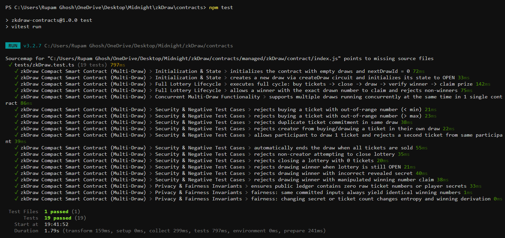
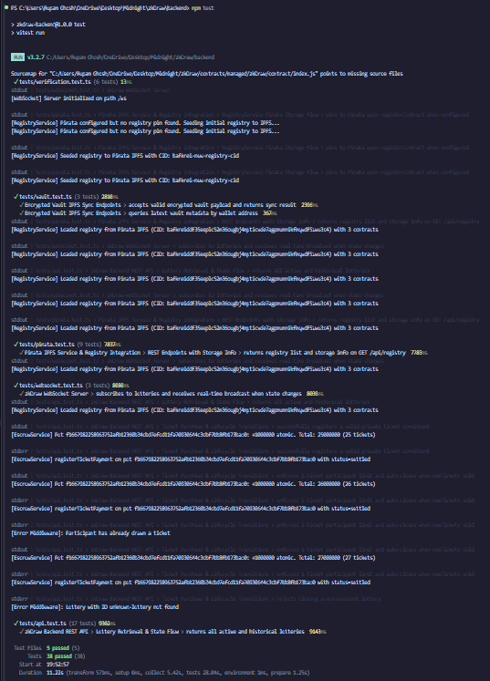
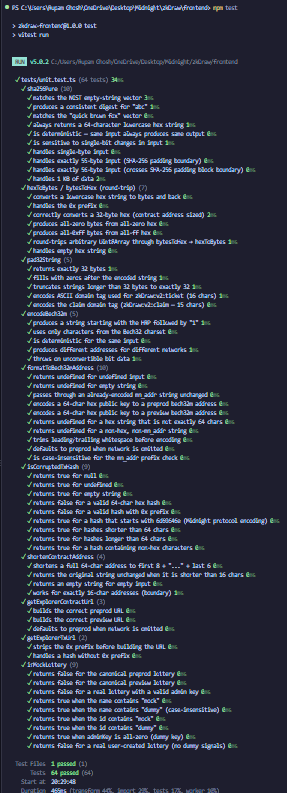
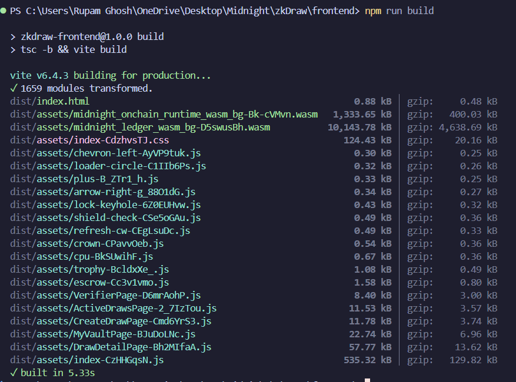

# Testing

zkDraw has **118 automated tests** across three workspaces — contracts, backend, and frontend — all running under [Vitest](https://vitest.dev/).

Run every suite at once from the project root:

```bash
npm run test:all
```

Or run each workspace individually:

---

## Contract Tests — 19 Tests

Tests the compiled Compact smart contract bindings in `contracts/managed/` using the `@midnight-ntwrk/compact-runtime` pure circuits. Covers draw creation, ticket commitment derivation, winner selection (Euclidean division), claim nullifier logic, and edge cases.

```bash
cd contracts
npm test
```

<div align="center">
  
</div>

---

## Backend Tests — 35 Tests

Tests the Express REST API routes, WebSocket server, ZK draw verifier, Pinata IPFS service, and escrow vault logic via `supertest`. Runs against a live in-process app instance — no external network required.

```bash
cd backend
npm test
```

<div align="center">
  
</div>

---

## Frontend Tests — 64 Tests

Unit tests for all pure, browser-independent logic in the frontend — no DOM, no wallet, no WASM required. Covers:

| Module | Tests | What's verified |
|---|---|---|
| `crypto.ts` — `sha256Pure` | 10 | NIST vectors, padding boundaries, determinism, bit-sensitivity |
| `crypto.ts` — `hexToBytes` / `bytesToHex` | 7 | Round-trips, `0x` prefix, empty input, edge bytes |
| `crypto.ts` — `pad32String` | 5 | Length, zero-fill, truncation, domain-tag encoding |
| `crypto.ts` — `encodeBech32m` | 5 | HRP prefix, Bech32 charset, determinism, per-network uniqueness |
| `crypto.ts` — `formatToBech32mAddress` | 10 | `undefined`/empty, pass-through, preprod/preview, whitespace trim |
| `config.ts` — `isCorruptedTxHash` | 9 | `null`/`undefined`, valid hashes, `0x` prefix, Midnight protocol prefix |
| `config.ts` — `shortenContractAddress` | 4 | Full address, short string, empty, 16-char boundary |
| `config.ts` — Explorer URL helpers | 5 | Correct URL construction per network |
| `api.ts` — `isMockLottery` | 9 | Canonical lotteries, mock/dummy name & id detection, all-zero admin key |

```bash
cd frontend
npm test
```

<div align="center">
  
</div>

### Frontend Typecheck & Build

The `build` script runs `tsc -b` (typecheck) followed by `vite build` (bundle). In CI these run as two explicit separate steps for faster failure feedback.

```bash
cd frontend
npm run build
```

<div align="center">
  
</div>

---

## What's Not Tested Here

| Excluded | Reason |
|---|---|
| `npm run compile` (Midnight Compact compiler) | Requires the proprietary `compact` binary; not available on CI runners. The `contracts/managed/` artifacts are committed to the repo and used directly. |
| Frontend component tests (`@testing-library/react`) | Not yet installed. Tracked for a future suite once the UI stabilises. |
| Live Midnight network calls | Integration tests against the real Preview/Preprod networks run manually before each deployment. |

---

## CI/CD Integration

All three test suites run automatically on every push and pull request to `main` or `dev` via GitHub Actions. See [`.github/workflows/ci.yml`](../.github/workflows/ci.yml) for the full pipeline definition.
