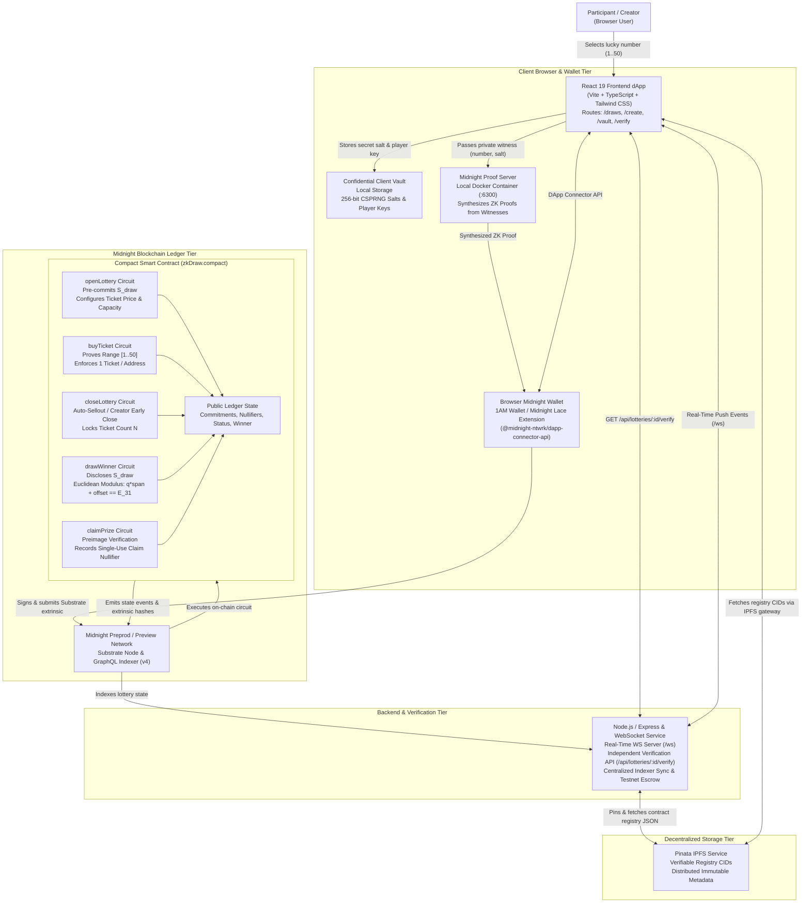
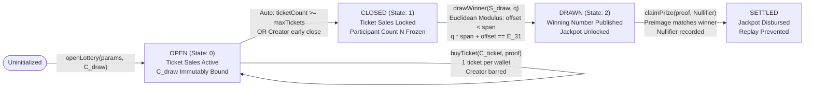
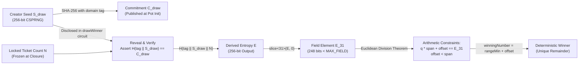
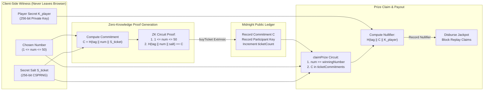
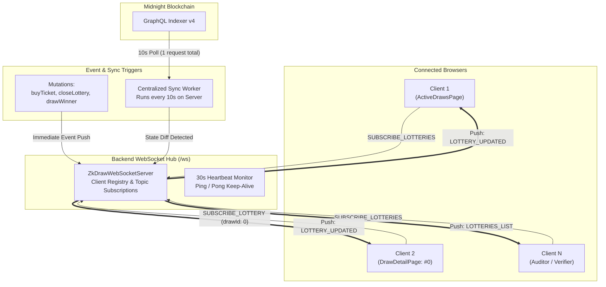

# zkDraw: System Architecture

zkDraw is a decentralized, zero-knowledge lottery protocol designed natively for the **Midnight blockchain**. The protocol combines Compact smart contracts, client-side zero-knowledge proofs, provable Euclidean modulus arithmetic, decentralized IPFS storage, and independent cryptographic verifiers to provide mathematically fair and confidential prize draws.

---

## System Context

---

## Component Responsibilities

| Component | Location | Responsibility |
|:---|:---|:---|
| **Frontend dApp** | `frontend/src/` | React 19 + TypeScript + Vite user interface providing multi-draw discovery (`/draws`), pot initialization (`/create`), confidential ticket purchasing (`/draws/:id`), local salt vault (`/my-tickets`), real-time WebSocket state client, and independent cryptographic verification (`/verify`). |
| **Wallet Connector** | `frontend/src/midnight/` | Manages 1AM and Midnight Lace extension connectivity, network toggle between Preprod and Preview, balance queries, persistent session restoration, and extrinsic signing. |
| **Compact Contract** | `contracts/zkDraw.compact` | Native Midnight zero-knowledge smart contract declaring dual-state transitions across five circuits: `openLottery`, `buyTicket`, `closeLottery`, `drawWinner`, and `claimPrize`. |
| **Proof Server** | Docker container (`:6300`) | Containerized proving service synthesizing zero-knowledge proofs from private witnesses (lucky number, entropy salt, player key, operator seed) without exposing plaintexts. |
| **Independent Verifier** | `backend/src/verification/` & `frontend/src/pages/VerifierPage.tsx` | Mathematical verification engine testing commitment validity, domain-separated entropy derivations, Euclidean division uniqueness, and range compliance. |
| **Pinata IPFS Service** | `backend/src/services/pinata.service.ts` | Decentralized storage integration pinning the contract registry (`zkdraw_contract_registry.json`) to IPFS, retrieving verified CIDs, and unpinning obsolete revisions. |
| **Backend & WS Server** | `backend/src/` | TypeScript Express REST and `ws` WebSocket service providing real-time state broadcasting, centralized 10s on-chain indexer sync, health monitoring, and independent verification endpoints. |

---

## Lottery Lifecycle & State Machine Pipeline

1. **Phase 1 (Initialization)**: Creator commits secret seed hash $C_{\text{draw}} = \mathcal{H}(\text{"zkDraw:v1:draw"} \,\|\, S_{\text{draw}})$ and configures ticket price and supply.
2. **Phase 2 (Ticket Purchasing)**: Participants submit range-proven commitments $C_{\text{ticket}}$. The contract verifies that the creator cannot purchase tickets and enforces one ticket per participant.
3. **Phase 3 (State Closure)**: The pot transitions to `CLOSED` upon reaching maximum capacity or when the creator triggers early closure.
4. **Phase 4 (Winner Draw)**: The creator reveals $S_{\text{draw}}$, which is proven against $C_{\text{draw}}$. The ZK circuit computes the winning number remainder via Euclidean division constraints.
5. **Phase 5 (Prize Claim)**: Winners prove ticket ownership and submit a single-use nullifier to claim funds without disclosing their identity.

---

## Provable Random Number Generation Pipeline

- **Commitment Integrity**: $S_{\text{draw}}$ is generated and locked before any ticket is purchased.
- **Dynamic Salt Inclusion**: The locked ticket count $N$ is hashed into the entropy, preventing precomputation even if the seed were compromised.
- **Euclidean Remainder Uniqueness**: Given positive integers $E_{31}$ and $\text{span}$, the quotient $q$ and remainder $\text{offset}$ are uniquely determined ($0 \le \text{offset} < \text{span}$), preventing the operator from selecting an arbitrary winner.

---

## Confidential Ticket Commitment & Claim Pipeline

---

## Real-Time WebSocket State Synchronization Pipeline

- **Zero-Polling Client Model**: Replaces client-side interval polling with bi-directional persistent WebSockets. Clients receive instant push notifications for ticket sales, pot capacity changes, and draw conclusions.
- **Centralized On-Chain Worker**: Rather than $N$ browser clients simultaneously querying the Midnight indexer or REST endpoints every few seconds, the backend executes a single query every 10 seconds and multicasts diffs across active subscriptions.
- **Cloud Scaling & Reverse Proxy Protection**: Express sets `trust proxy: 1` and uses tiered rate limiters (3,000 requests/15m read, 120/15m write, health-check exemption), resolving reverse-proxy IP collapsing and HTTP 429 errors.

---

## Key Architectural Invariants

1. **Zero Witness Exposure**: Uncommitted lucky numbers and 256-bit salts reside exclusively in client memory and local vault storage; they are never sent to backend APIs, mempools, or block explorers.
2. **Mathematical Determinism**: The winning number is generated strictly through Euclidean division constraints inside ZK circuits, preventing operator manipulation or front-running.
3. **Sybil & Replay Resistance**: On-chain participant key tracking ensures exactly one ticket per wallet address, and deterministic single-use nullifiers guarantee jackpot prizes cannot be double-claimed.
4. **Decentralized Storage Resilience**: Contract registries are pinned to IPFS via Pinata with verifiable CIDs, removing single-point-of-failure dependencies on centralized databases.
5. **Auditable Verification**: Any observer can independently execute the verification algorithm in-browser or programmatically via REST API to validate draw honesty.
6. **Real-Time Push Synchronization**: UI states reflect live on-chain and off-chain transitions in 0ms via persistent WebSockets, eliminating polling spam and client rate-limit exhaustion.
